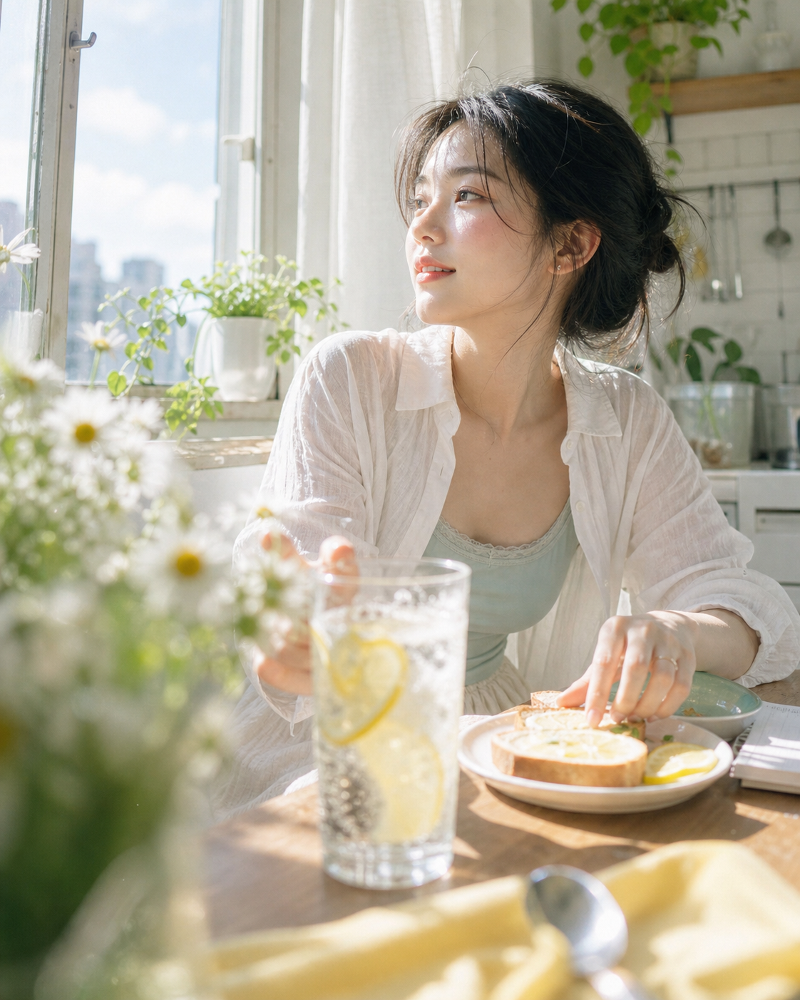
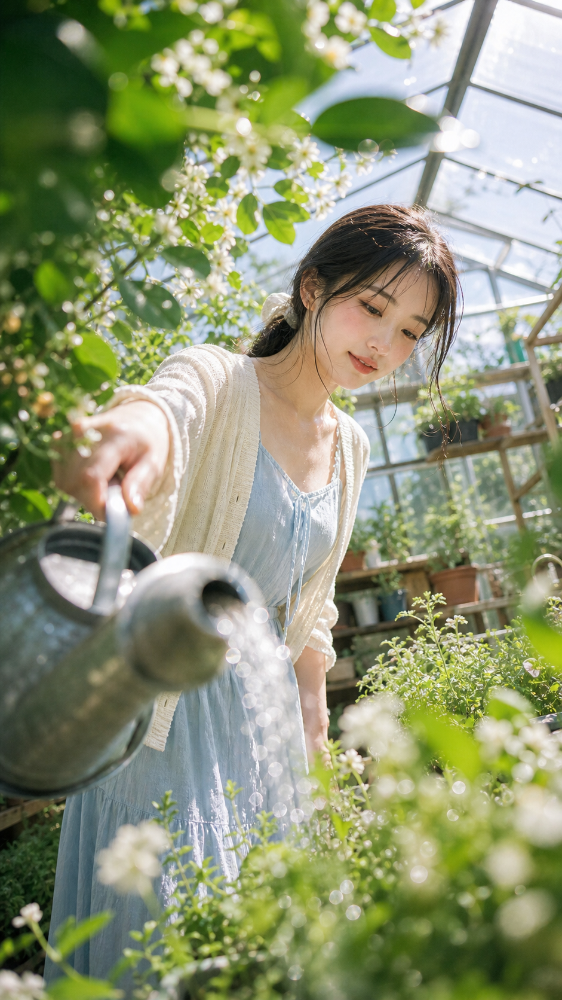
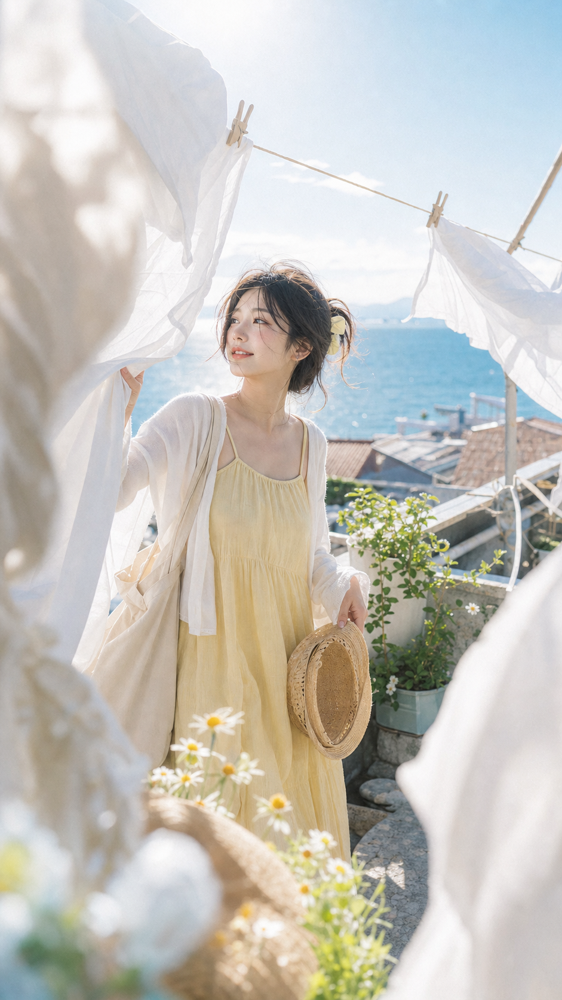
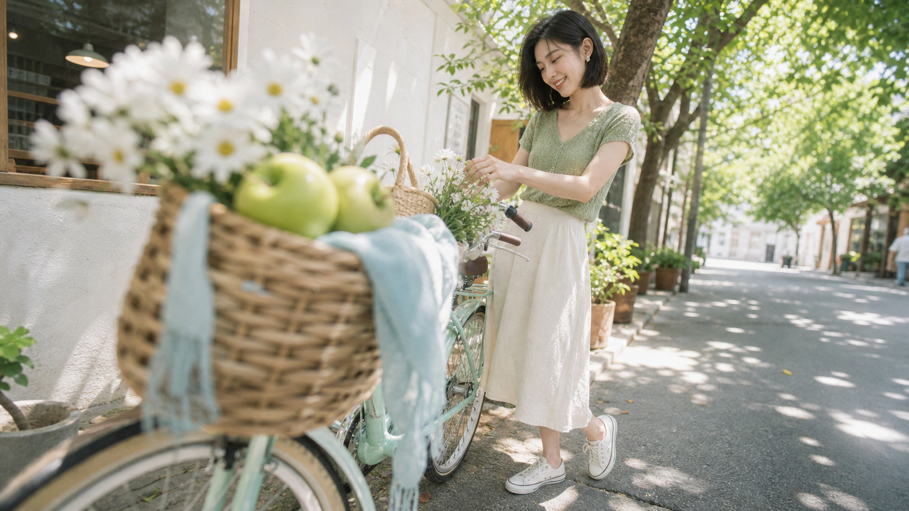

# AI Photo Shoot Director Skill

把 AI 写真、真实摄影、ChatGPT image-2 / gpt-image-2 生图需求，整理成更像摄影现场导演稿的 Codex skill。

它的目标不是堆叠“好看、氛围感、高级感”，而是把一张图拆成可执行的摄影要素：主题、成像方式、人物妆造、前景/人物/背景三层空间、镜头构图、动作骨架、光线质感和负面护栏。

## 视觉效果示例

这些图使用本 skill 的提示词方法生成，重点展示“真实摄影的不完美质感”和“场景三层”。

| 窗边早餐桌近景 | 温室浇水低机位 |
| --- | --- |
|  |  |
| 前景气泡水、雏菊和餐具压近镜头，晨光穿过白纱帘，形成小清新但不塑料的胶片质感。 | 绿叶和浇水壶贴近镜头，温室玻璃漫射自然光，水珠、发丝和叶片承担真实摄影细节。 |

| 海边晾衣线白蓝感 | 街角单车花篮广角 |
| --- | --- |
|  |  |
| 白色床单和晾衣绳遮挡画面边缘，海边逆光让布料半透明发亮，形成蓝白夏日空气感。 | 自行车花篮占据前景，轻微广角透视和树影光斑让画面更适合作为文章插图。 |

## 适合什么场景

- AI 写真提示词创作
- 真实摄影感人像生成
- ChatGPT image-2 / gpt-image-2 prompt 优化
- 小清新、古风、棚拍、CCD、胶片、手机抓拍等风格导演
- 文章插图、封面图、摄影案例图的 prompt 拆解
- 诊断为什么生成图太 AI、太塑料、太平、没有现场感

## 安装

```bash
python3 ~/.codex/skills/.system/skill-installer/scripts/install-skill-from-github.py \
  --repo geslie1/ai-photo-shoot-director-skill \
  --path . \
  --name ai-photo-shoot-director
```

安装后，Codex 会在相关任务中自动触发 `ai-photo-shoot-director`。

## 使用方式

你可以直接这样提需求：

```text
帮我写一个夏日果园氧气写真 prompt，要有文章图例那种真实摄影质感。
```

```text
用 ai-photo-shoot-director 生一组小清新风格图片，并把每张图的提示词附上。
```

```text
诊断一下这个 prompt 为什么生成出来太像 AI 影楼照，并帮我改成真实抓拍感。
```

## 输出模式

### 完整导演稿

默认模式。会先解释画面成立点，再给出结构化 prompt 和 negative prompt。

### 只要最终提示词

适合复制到生图工具里。只输出最终 prompt 和负面约束。

### 直接生成图片

只有当你明确要求“生成图片 / 生图 / 直接出图”时，才会调用生图能力。

## 方法论

这个 skill 固定使用八段式摄影导演流程：

1. 画面主题：这张图为什么成立
2. 成像方式：富士户外胶片、尼康真实感、手机抓拍、直闪 CCD、柔雾棚拍等
3. 质感锁：前景虚化、眩光、颗粒、暗部抬起、局部柔焦、反 AI 精修约束
4. 人物设定：明确成年虚构人物、脸型气质、发型、真实皮肤质感
5. 妆容锚点：只抓最小识别点，避免变成美妆广告
6. 服装造型：颜色、材质、可穿性和主题关系
7. 场景三层：前景、人物所在平面、背景，而不是只写“室内/室外”
8. 镜头动作光线：距离、角度、裁切、动作骨架、光线来源和结果

核心原则：把 prompt 写成摄影团队能执行的拍摄说明，而不是形容词清单。

## 示例 Prompt

```text
9:16 竖图，真实摄影，温室浇水小清新写真，尼康真实细节结合轻富士户外色彩。

前景是大片绿叶、小白花和金属浇水壶边缘，贴近镜头并明显虚化，遮挡画面上方和侧边；轻微镜头眩光，细胶片颗粒，暗部抬起，克制锐化，不要HDR，不要商业精修。

一位明确成年的虚构东亚女性，浅蓝棉布连衣裙、奶油色开衫、帆布鞋，黑发低马尾，有细碎发丝，桃粉淡妆和清透唇色，保留真实皮肤质感。

她站在温室植物架之间，微微俯身给香草浇水，视线跟随水流。背景有半透明温室屋顶、木质植物架、陶盆、育苗盘和玻璃水汽。

上午阳光从右上方穿过温室玻璃，落在发丝、袖口、水珠、叶片和脸侧，形成轻微眩光、绿色反射、空气雾感和细小颗粒。画面明亮、清新、真实抓拍。
```

负面约束示例：

```text
不要未成年人或年龄模糊，不要真实品牌 logo，不要可读文字，不要水印，不要暴露或性化姿势，不要塑料皮肤，不要过度磨皮，不要8K超清商业精修，不要HDR，不要AI渲染感，不要手指畸形，不要多余肢体，不要断裂手脚，不要大幅扭头回望，不要所有前景和背景都同样清晰。
```

## 仓库结构

```text
.
├── SKILL.md
├── agents/
│   └── openai.yaml
├── references/
│   └── photo-shoot-method.md
└── assets/
    └── readme/
        ├── fresh-breakfast-window.png
        ├── fresh-greenhouse.png
        ├── fresh-seaside-laundry.png
        └── fresh-bicycle-street.png
```

## 安全边界

- 默认面向明确成年、虚构人物写真。
- 避免未成年人、年龄模糊、露骨色情、身份伪造和真实品牌误用。
- 不把“完美皮肤、8K、超清、商业精修”作为默认目标；如果追求真实摄影感，会优先保留光学瑕疵和现场感。
